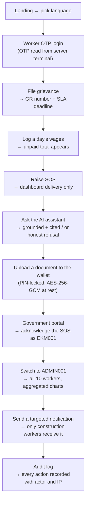

# ShramSetu — Demo / Viva Guide

A worker-facing labour-rights platform: file grievances, log wages, raise an SOS,
and ask an AI assistant about welfare schemes **in your own language** — with a
government portal scoped by jurisdiction.

Stack: **React + Vite** (frontend) · **Node.js/Express + MongoDB** (API, auth,
all business logic) · **Python/FastAPI** (RAG, speech) · **LangChain + FAISS +
Groq** (retrieval-grounded answers).

---

## 0. Before you present (5 minutes)

```powershell
# stop anything left over from a previous run
powershell -NoProfile -ExecutionPolicy Bypass -File stop-all.ps1

# start everything and WAIT until the AI service is genuinely ready
powershell -NoProfile -ExecutionPolicy Bypass -File start-all.ps1
```

`start-all.ps1` polls `GET /health/ready`, which returns **503 until the AI
models have finished loading**, so the script blocks until the chatbot can
actually answer. Expect a ~30 s wait on the first run and `[WARM]` if you
interrupted it. It prints which model is still loading:

```
[OK]   API      :8000
[OK]   AI       :8100
[OK]   Frontend :5199
```

**Reset the demo data** so the demo starts from a known state:

```bash
cd server && npm run demo:reset        # asks before deleting; add -- --yes to skip
```

It deletes workers and everything they own (grievances, wage entries, SOS alerts,
chat history, notifications, wallet metadata), then re-seeds from the same
seeder the server boot uses. Government officials and the bootstrap admin are
**kept** so logins keep working. It refuses to run when `ENV=production`. With
the default `MONGODB_URI=memory` it tells you to just restart the server — that
dev database is fresh on every boot.

---

## 1. Credentials

| Role | Where | Credentials |
|---|---|---|
| Superadmin | `/government/login` | `ADMIN001` / `Admin@123` |
| State official (Kerala) | `/government/login` | `KL001` / `Kerala@123` |
| District official (Ernakulam) | `/government/login` | `EKM001` / `Ernakulam@123` |
| Worker (password) | `/worker/login` → 🔑 tab | `9555500101`–`9555500110` · password `Worker@123` |
| Worker (OTP) | `/worker/login` → 📱 tab | any seeded mobile; OTP prints **only in the server terminal** |

**Seeded workers (10).** Ramesh Kumar (construction, Ernakulam) · Sunita Devi
(domestic work) · Md. Imran Sheikh (garment, Kozhikode) · Lakshmi Narayanan
(agriculture, Palakkad) · Rahul Verma (driver) · Anjali Kumari (hospitality) ·
Karthik Rajan (factory, Coimbatore) · Priya Chatterjee (security) · Suresh Yadav
(street vendor) · Meena Kumari (construction, Coimbatore). 11 grievances across
9 categories, each with a seeded status and SLA deadline.

District split: **Ernakulam 3, Kozhikode 1, Palakkad 1, Thrissur 1,
Thiruvananthapuram 2** (Kerala, 8 total) and **Coimbatore 2** (Tamil Nadu).
Good demo pair: **the Ernakulam official sees 3 workers, the superadmin sees
all 10** — that single contrast is the strongest scoping proof you have.

---

## 2. Six-minute demo flow

The flow is built so each step sets up the next: the grievance you file is the
one the official acts on, the wage shortfall becomes a complaint, the SOS is the
alert the district official acknowledges.



### Step-by-step, with what to say

1. **Landing → language** — pick Hindi. Every page, button and error is
   translated; the AI answers in the worker's language too.

2. **Worker login** — `9555500101` → Continue → read the 6-digit OTP from the
   **server terminal** and type it in. *The website never displays or
   auto-fills the OTP* — say this out loud, it's a real security property, not
   a demo trick. Dashboard shows worker ID `SS-100001` and its QR.
   (Honest caveat if asked: the QR encodes the worker-ID string only. It is an
   identifier display, **not** a verifiable credential.)

3. **File a grievance** — category "Unpaid wages" → gets an auto
   `GR-XXXXXXXX` number, **high** priority (assigned from the category, not
   chosen by the worker: `harassment_abuse`/`workplace_safety` → urgent,
   `unpaid_wages`/`illegal_termination` → high, everything else → medium) and a
   **14-day SLA deadline** from that priority. SLA = `urgent 7 · high 14 ·
   medium 30 · low 45` days.

4. **Wage diary** — log a day with agreed 700 / paid 450 → the month summary
   shows the unpaid total → **"File unpaid wage complaint"** opens the grievance
   form pre-filled (category `unpaid_wages`, amounts in the description).
   *Entries are self-reported and never verified against an employer — the UI
   says so under the list.*

5. **SOS** — the red tile → the modal states plainly that the alert appears on
   **officials' dashboards only, and no SMS or call is sent**. Raise it. This is
   an honest limit, not a missing feature; the state is named
   `dashboard_only` in the code and in the API.

6. **AI assistant** — two questions, in this order:
   - *"What is the minimum wage and which law fixes it?"* → a **grounded** answer
     citing the **Code on Wages, 2019**, with a sources panel showing the
     official URL and last-verified date, and the "informational only, not legal
     advice" line.
   - *"Who won the cricket match yesterday?"* → an **honest refusal**, not a
     hallucination. This is the single most impressive 10 seconds of the demo:
     retrieval is gated at similarity 0.45, so off-topic questions retrieve
     nothing and the assistant says so.

   Then toggle 🔊 (Sarvam/Google TTS) and 🎤 (local Whisper), switch the UI to
   Hindi and ask in Hindi — retrieval still grounds the answer because the
   question is translated to English *before* retrieval.

7. **Document wallet** — set a PIN (4–8 digits; five wrong attempts locks it
   for 5 minutes), upload a PDF, download it back. Files are AES-256-GCM
   encrypted at rest with per-file keys wrapped under `DOC_MASTER_KEY`.
   *The PIN is a convenience screen-lock, not encryption* — say this if asked.

8. **Jurisdiction scoping** — log in as `EKM001 / Ernakulam@123` → worker list
   shows **only the 3 Ernakulam workers**; open a Coimbatore grievance → **not
   found**. Then `ADMIN001 / Admin@123` → Overview shows **all 10 workers / 11
   grievances** with category and state charts (Mongo aggregation pipelines).

9. **Targeted notification** — target `occupation: construction` → **only the 2
   construction workers** receive it. A non-superadmin cannot target "all
   workers" or another state (HTTP 403).

10. **Audit log** — every login, grievance action and notification send is
    recorded with actor, IP and outcome.

---

## 3. If an examiner asks "how do you know it works?"

Run it. These are the numbers as of this commit:

```bash
cd server    && npm test    # 50 passed  — scoping, ownership, upload crypto, rate limits
cd frontend  && npm test    # 54 passed  — wallet PIN lockout, auth gate, i18n bundle parity
cd ai-service && venv/Scripts/python -m pytest   # 68 passed — corpus, RAG, PII, injection, cold start
cd server    && npm run verify                  # 32 live checks across BOTH services
```

The RAG report (`ai-service/eval/RESULTS.md`, regenerated by
`venv/Scripts/python eval/run_eval.py`) is the strongest evidence:

| Metric | Value |
|---|---|
| Corpus | 62 active documents (11 superseded ones correctly skipped) |
| hit@1 | **46/49 = 94%** |
| hit@3 | **48/49 = 98%** |
| Off-topic + prompt-injection refused at retrieval | **12/13 = 92%** |

Retrieval-only mode, so it needs no LLM key and runs in ~30 s. `eval/ANALYSIS.md`
explains *why* the numbers are what they are — including the one question that
still misses and the proof that it is a translation failure, not a retrieval one.
The threshold (0.45) was **not** lowered to reach these numbers; lowering it is
what produces confident wrong answers.

---

## 4. Troubleshooting

| Symptom | Cause and fix |
|---|---|
| **OTP not visible** | It prints in whichever **server terminal** owns the API. Detached runs mirror it to `server/logs/otp-dev.log`. The UI never shows it. Resend cooldown is 60 s per number, then HTTP 429. |
| **Chatbot says "starting up"** | The AI service is still warming. `curl http://127.0.0.1:8100/health/ready` → 503 means "still loading"; the `warmup` object names the model. Requests wait up to `WARMUP_WAIT_SECONDS` (90 s) before returning a fast 503. |
| **AI answers "unavailable"** | The ai-service is not running, or `GROQ_API_KEY` is empty. Retrieval still works; the Node server falls back to a clearly-labelled static reply — it never pretends the AI answered. |
| **Answers never cite a source** | Check the answer says *informational only, not legal advice*; that line means the LLM ran and the grounding prompt held. A missing sources panel means retrieval was refused. |
| **Voice slow the first time** | Normal once: Whisper loads on first transcription. It is prewarmed at boot, so this only happens if you started the AI service by hand. |
| **"No workers match this target"** | The targeted send matched zero workers. Seeded occupations/states are listed above. |
| **Demo data looks wrong** | `cd server && npm run demo:reset`. |

---

## 5. Honest limitations (say these before you're asked)

These are in [docs/SECURITY.md](docs/SECURITY.md) and [README.md](README.md);
rehearse them, because volunteering a limit reads as competence.

- **No SMS delivery.** OTPs print to a terminal and SOS alerts reach
  government dashboards only. There is no real SMS gateway and no verified
  government integration.
- **OTP is development-only.** The code prints the OTP rather than sending it,
  and it works only on the terminal that owns the server.
- **AI is informational, not legal advice**, and only answers from the bundled
  corpus. It refuses rather than guessing.
- **Wage entries and grievances are self-reported** — never verified against an
  employer or an official record.
- **The wallet PIN is a screen lock, not encryption.** Documents are encrypted
  server-side; the PIN gates the UI only.
- **Rate limiting is per-process and in-memory**, so a multi-instance
  deployment would need a shared store (Redis).
- **Single language coverage is 6** (en, hi, bn, te, ta, ml); the registry is
  data-driven, so adding one is a JSON file plus a registry entry.
- **Not production-ready.** With `ENV=production` the server *refuses to boot*
  unless `JWT_SECRET_KEY` is set, the admin password is changed, OTP echo is
  off, demo seeding is off, `DOC_MASTER_KEY` is set and MongoDB is not the
  in-memory instance.