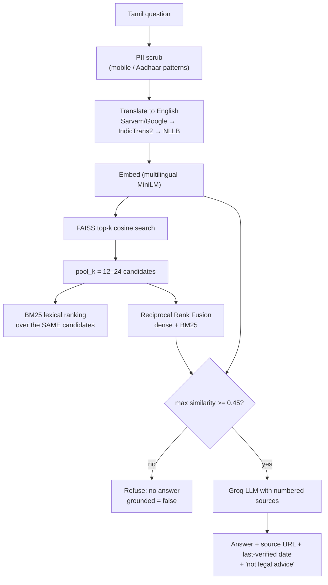

# ShramSetu — Viva Preparation: Questions & Defensible Answers

Written against the code as it stands. Every number here is produced by a
command you can run during the viva — see §9. Where the honest answer is "no,
and here's why", that is the answer that scores; a defended limitation is worth
more than a defended claim.

---

## 1. Architecture

**Q. Why is the AI a separate service instead of calling an LLM from Node?**

Three reasons that are actually load-bearing here:

1. **The ML stack lives in Python.** FAISS, SentenceTransformers,
   faster-whisper and IndicTrans2 have no mature Node equivalents. Express
   stays a boring CRUD + auth API.
2. **Failure isolation.** The Node process is small and fast to restart. A
   2 GB model crashing must not take auth, grievances and documents down with
   it.
3. **Different scaling profile.** The AI service is CPU/RAM-heavy and warm-up
   bound; the API is IO-bound. They scale on different axes.

**Q. But isn't an HTTP hop between your own services just latency?**

Yes, and it is ~1 ms on localhost — negligible next to the 1–2 s an `/ask`
costs. The trade is worth it. The one real cost is that the AI service is a
single point of failure, which is why the Node proxy has a localized fallback
reply instead of hanging (§8).

**Q. How do the services authenticate to each other?**

A shared secret, `AI_INTERNAL_KEY`, sent as `X-Internal-Key` on every request
and compared in middleware in `ai-service/main.py`. Every route **except** the
three health paths requires it — a container probe has no way to present the
key, and a readiness probe must never be the thing that fails. It is a
service-to-service secret, not user auth; both services bind to `127.0.0.1` in
dev.

**Q. Why is authorization centralised?**

One place decides who can see what: `middleware/auth.js` + `utils/scope.js` in
the Node service. The AI service never makes an authorization decision — it
only answers questions, so there is no second copy of the rules to drift.

---

## 2. The RAG pipeline — the deepest questions

**Q. Walk me through exactly what happens when a worker asks a question in Tamil.**



Note the order: **translate before retrieval, generate in the worker's
language**. The answer is never machine-translated back from English; only the
retrieval query is translated.

**Q. Why hybrid BM25 + dense retrieval? Isn't dense enough?**

Dense retrieval embeds meaning but is weak on rare literal tokens — scheme
names, section numbers, "Section 21". BM25 is the reverse: exact lexical
matching, no synonym understanding. In this domain both failure modes are real:
"e-Shram", "MGNREGA", "Code on Wages 2019" are exactly the strings a worker
types and exactly what embeddings blur together.

The fusion is **Reciprocal Rank Fusion** (k=20): for each list, add
`1/(k + rank)`, sum across lists. RRF was chosen over a weighted score blend
because it uses only *ranks*, so it needs no score calibration between a cosine
similarity and a BM25 score — which are not on comparable scales.

**Q. What was the single biggest retrieval improvement you made?**

Ranking on the **worker's original, untranslated** question as a second RRF
ranker, alongside the English translation. The translation is right for the
dense retriever (it needs English to match English documents) and actively
harmful for the lexical one: six sibling language questions translated to the
same English string become indistinguishable to BM25, which destroys exactly the
lexical signal BM25 was added for. Feeding both queries in recovered
hit@3 from 87% → 98%.

**Q. How do you prevent hallucination?**

Three independent mechanisms, because any one of them alone is defeatable:

1. **The retrieval gate.** If the best chunk scores below 0.45 similarity, the
   pipeline refuses before the LLM is ever called. Off-topic and
   prompt-injection questions measure ≤ 0.42; genuine hits measure ≥ 0.47.
2. **Source forcing.** The LLM is given numbered chunks and instructed to cite.
   The response carries `source_document`, `government_department` and the
   verification date from the document's own provenance header.
3. **Superseded-law handling.** Documents carry a `STATUS:` header. Repealed
   Acts are indexed but the loader marks them superseded, and the pipeline can
   answer "this was replaced by X" instead of quoting dead law.

**Q. Why is the threshold 0.45, and would lowering it improve your numbers?**

It would — and that is exactly why it stays. The margin between the off-topic
band (0.366–0.422) and genuine hits (≥0.47) is only ~0.028, so lowering the gate
buys recall at the cost of confidently answering questions the corpus cannot
support. The one question that still misses (§10) sits at 0.414 — *below* the
gate, not above it — so lowering the gate would have made it pass while making
the refusal behaviour worse. `eval/ANALYSIS.md` documents this decision.

**Q. Is the chatbot's answer legally reliable?**

No, and the UI says so on every answer. It only answers from the bundled corpus
of official documents, each carrying a source URL and a last-verified date, and
it carries an explicit "informational only, not legal advice" line. A labour
officer's advice still requires reading the source.

---

## 3. Cold start — a good question to ask *you*

**Q. What happens if someone asks a question immediately after a restart?**

The AI service loads three models and a vector index in background threads.
Uvicorn binds the port the instant those threads are *spawned*, so for roughly
30 seconds the port answers while `/ask` cannot.

This used to be invisible: `/health` returned a constant `ok`, the launcher
printed `[OK]`, and the first question blocked until the Node proxy aborted it at
120 s — which the worker saw as *"ai-service unavailable: This operation was
aborted"*. The health check wasn't lying by accident; it had no way of knowing.

Now the service tracks its own warm-up state and splits the two questions:

| Endpoint | Warming | Ready | Why both |
|---|---|---|---|
| `/health/live` | 200 | 200 | Liveness only — **never** reflects warm-up |
| `/health/ready` | **503** + which model is loading | 200 | What the launcher and any deploy script gate on |
| `/health` | 200, `ready: false` | 200, `ready: true` | Liveness plus full state |

Liveness deliberately does not track warm-up: **restarting a warming service
restarts the very load it was waiting on**, which turns a 30 s wait into an
infinite one.

A `/ask` arriving mid-warm-up waits up to `WARMUP_WAIT_SECONDS` (90, below the
Node proxy's 120 s abort) so the good case still gets a real answer; past that
it returns a fast 503 and the proxy shows the localized "still starting"
message. Honest limit: on slower hardware a cold start can exceed 90 s, and the
worker gets a retryable message rather than a slow answer.

---

## 4. Security — expect the uncomfortable questions

**Q. Walk me through a possible attack on this system.**

The most interesting one is **cross-jurisdiction data leakage**. A district
official must not see workers outside their district, and must not be able to
*fetch* a record by guessing an ID even if the listing is filtered. The answer
is that scoping happens in the query, not in the UI: the official's district is
applied as a filter on every read, so a record outside the scope is simply not
found (404, not 403 — returning 403 would confirm it exists). Write paths
re-validate jurisdiction rather than trusting a client-supplied ID.

Second: **PII leaving the system.** Worker text goes to Groq, Sarvam and Google.
Phone and Aadhaar patterns are scrubbed *before* retrieval, translation and the
LLM — the entire pipeline is downstream of the scrub, in both the Python and
Node layers.

**Q. Is the document wallet PIN real security?**

No, and the code says so at the top of `documentSecurity.ts`. It is PBKDF2-SHA256
with 150 000 iterations and a per-user salt, and it does enforce a five-attempt
lockout with a five-minute window — but it is a **screen lock**. Real protection
is server-side AES-256-GCM with per-file keys wrapped under `DOC_MASTER_KEY`.
Anyone holding the worker's API token can fetch documents through the API
regardless of the PIN. The 23 frontend tests assert the lockout behaviour
specifically.

**Q. What if `DOC_MASTER_KEY` is lost?**

Every wallet file becomes permanently unrecoverable. That is deliberate — it is
the cost of not being able to decrypt without the key — but it means key
management and escrow are a real deployment requirement, and there is no
recovery path in this repository.

**Q. Any dependency vulnerabilities?**

Yes, two in the frontend, both understood and neither fixed deliberately: a
HIGH in `braces` reached only through `tailwindcss@3 → chokidar` (build-time
glob expansion, dev-only) and a MODERATE in `react-router-dom@6`. Resolving
them requires upgrading to `tailwindcss@4` and `react-router-dom@7` — two
breaking majors, one a routing rewrite across 16 pages. CI therefore gates on
`npm audit --omit=dev --audit-level=high` (no high/critical in shipped code) and
prints the full dev-inclusive audit for visibility. The server has zero
advisories.

**Q. Rate limiting?**

Per-IP, per-process, in-memory. Fine for the single-instance demo; a
multi-instance deployment would need a shared store (Redis), and that is stated
in the security notes rather than implied to be solved.

---

## 5. Multilingual design

**Q. How do you handle a question in a language the documents aren't in?**

The corpus is English. An Indic question is translated to English *before*
retrieval, and the grounded answer is generated directly in the worker's
language. Adding a language is a JSON translation file plus one registry entry —
routing, RTL-safe layout and the chatbot already accept an arbitrary IETF code.

**Q. What about translation latency and failure?**

Two things make it survivable. A **translation cache** keyed on
`(engine, source, target, text)` — in-process plus a gitignored JSON file —
turns a repeat question into a cache hit, which is also why the eval harness is
~10× faster and reproducible. And when a cloud MT provider is configured,
IndicTrans2 (~1 GB) is deliberately **not** prewarmed; the warm-up registry
records that as `skipped`, which is a decision, not a fault, and does not block
readiness.

**Q. What happens when translation fails?**

Translation is a retrieval aid, never a hard dependency. If every engine fails,
the original query is used — a Hindi speaker asking an English-titled scheme may
retrieve less well, but the chatbot degrades instead of crashing. (Known gap:
one eval question fails purely because machine translation produced
"What is the use of the Resource Employment Program?" for MGNREGA; hand-translating
the same query retrieves the correct document at 0.641 as the top hit. That is a
documented translation failure, not a retrieval one.)

---

## 6. Frontend

**Q. Why code splitting, and how did you measure it?**

All 16 pages are `React.lazy`-loaded behind a `<Suspense>` boundary that renders
a `role="status"` live region — a screen reader is told the page is loading
rather than landing on an empty document. Entry JS went **592 → 406 kB**
(−31 %); gzip 171 → 123 kB.

A second finding from the same work: Vite modulepreloads a manual chunk in full,
so lumping axios, lucide, idb, qrcode and workbox into one vendor chunk meant the
landing screen downloaded ~88 kB of libraries it never called. Only axios is now
in its own chunk (it *is* on the startup path, via the auth context); the rest
are left to Rollup, which places them in the page chunk that uses them.

**Q. How do you test a React app that talks to three services?**

Deliberately at the seams that hold logic, not by mocking everything:

- **54 tests** across 5 files: wallet PIN lockout logic, the auth gate's four
  outcomes, the status badge's "never colour alone" accessibility contract,
  i18n bundle parity across all six languages, and the lazy-loading fallback's
  live-region semantics.
- The i18n test asserts every bundle has the same sections and the same
  `grievance.status.*` keys as English, and that the registry matches the
  languages the server and AI service accept — a mismatch there fails at
  runtime, for a real worker, so it fails in CI instead.
- Server behaviour is covered by 50 tests plus 32 live end-to-end checks.

**Q. Anything you'd change about the frontend?**

The tests are unit and component level; there is no browser E2E suite. Playwright
covering the OTP → grievance → SOS → acknowledge loop would catch integration
regressions the current split cannot see.

---

## 7. Data model & scoping

**Q. How do you prevent one worker reading another's grievances?**

Ownership is enforced server-side on every route by an ownership filter built
from the authenticated user id — never from a client-supplied id. The server
test suite asserts this as a security property (not a happy path), including
that a delete is ownership-scoped.

**Q. Why is `owner_state`/`owner_district` denormalised onto the grievance?**

Because jurisdiction is **where it was filed**, not where the worker lives
today. A worker who moves districts must not silently move their open complaint
into a different official's queue, and an official must keep jurisdiction over
what they were already handling.

**Q. SLA deadlines — how are they set?**

Derived from priority: `urgent 7 · high 14 · medium 30 · low 45` days, computed
at creation and shown on the detail page. In a real system this would come from
the department's service-guarantee rules, and there is no escalation path when a
deadline is missed — only a visible overdue date.

---

## 8. Failure behaviour

**Q. What happens when the AI service is down mid-demo?**

The Node proxy catches it and returns a **localized, clearly-labelled static
reply** with `system_error: true` and `grounded: false`. It never fabricates an
answer or passes a fallback off as a real one — the eval harness scores that
same `grounded: false` signal, so a fallback reply cannot be mistaken for a
successful answer in the automated checks either.

---

## 9. Show me that it works

Run any of these live:

```bash
cd server     && npm test                                  # 50 passed
cd frontend   && npm test                                  # 54 passed
cd ai-service && venv/Scripts/python -m pytest             # 68 passed
cd server     && npm run verify                           # 32 live checks, both services
cd ai-service && venv/Scripts/python eval/run_eval.py      # → eval/RESULTS.md (~30 s)
```

| Metric | Value |
|---|---|
| Corpus | 62 active documents (11 superseded correctly skipped) |
| hit@1 | **46/49 = 94%** |
| hit@3 | **48/49 = 98%** |
| Off-topic + injection refused | **12/13 = 92%** |

Retrieval-only mode, so no API key is needed. `eval/ANALYSIS.md` holds the
narrative — what each change bought and what is still missing.

---

## 10. The question that will actually stump you

**Q. What's still wrong with it?**

Better to volunteer this than be asked:

1. **hit@1 is 94 %, not 100 %.** One question still misses. It was proven to be
   a *translation* failure — the correct document is retrieved at 0.641 when the
   query is hand-translated — so the fix belongs in the translation layer, not
   the retriever. We did not close it by lowering the gate.
2. **Eight in-domain "unanswerable" questions are unverified end to end.**
   They look on-topic, so they pass retrieval by design; whether the LLM refuses
   them is only checkable with `--full` mode and a working Groq key. That run
   has not been completed, so the number is not quoted as a result.
3. **Cold start is still ~30 s** and bounded at 90 s. The bound is tuned to this
   machine; on slower hardware it can trip.
4. **No real government or SMS integration.** Everything is seeded or
   dashboard-only, and the OTP prints to a terminal.
5. **No browser E2E suite**, no backups/DR story, in-memory rate limiting.

**Q. What would you do next, in order?**

1. Fix the translation path for named schemes (an entity-aware glossary for
   scheme names across all six languages) — highest value, it is a known
   measured failure, not a guess.
2. Playwright E2E over the OTP → grievance → SOS → acknowledge loop.
3. Complete the `--full` eval so the eight in-domain questions have a real
   number instead of an honest gap.
4. Redis-backed rate limiting and a real SMS gateway — both are deployment
   blockers, not features.