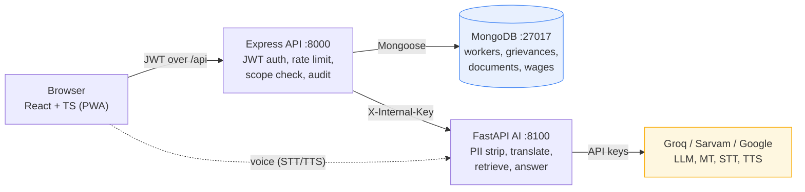
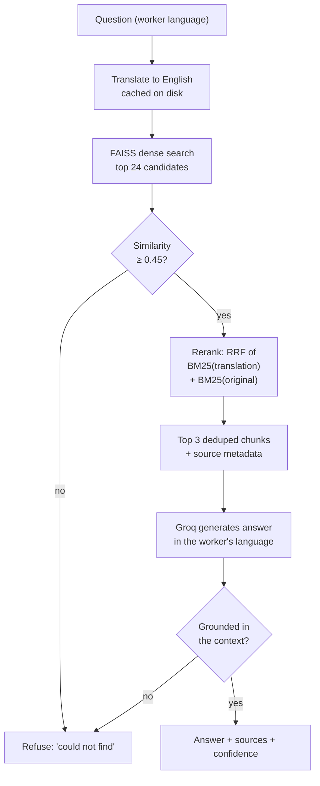
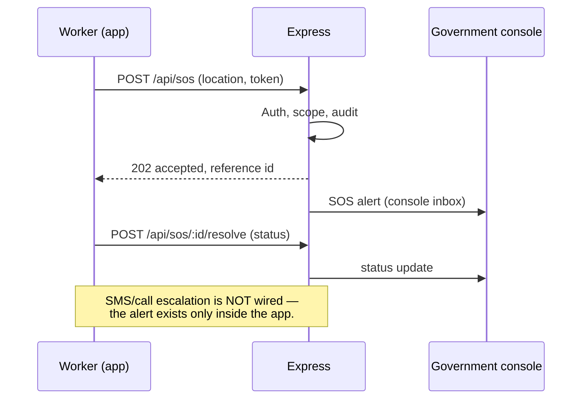
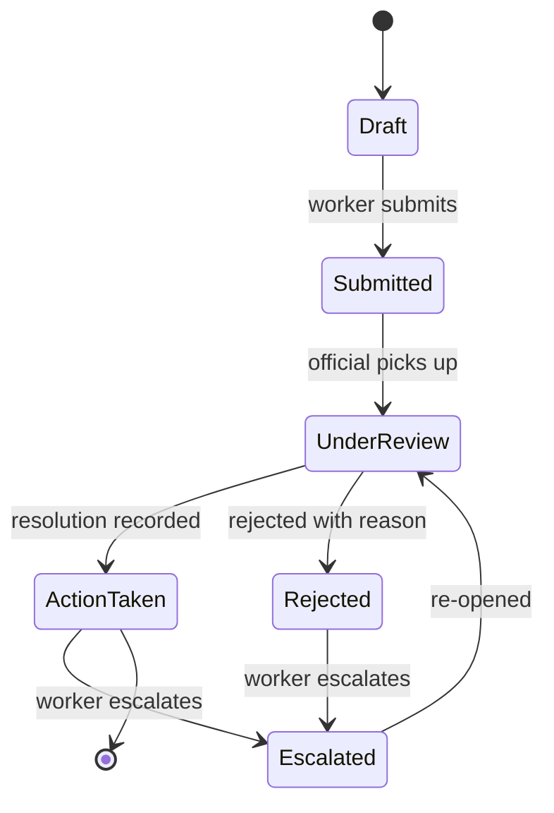

# ShramSetu — Architecture (current)

Companion to [README.md](../README.md) and [WORKFLOW.md](../WORKFLOW.md)
(deep walkthrough). This file is the quick, factual map of what runs where.

> **The stack is Node/Express + MongoDB, plus a separate Python/FastAPI AI
> service for RAG only.** An earlier version of this project was a single
> Python FastAPI backend with SQLModel/SQLite. That version is gone; documents
> describing it are in [`archive/`](archive/) and are marked as history.

## Services

| Service | Stack | Port | Entry |
|---|---|---|---|
| Frontend | React 18 + TypeScript + Vite + Tailwind (PWA) | 5173 (dev; `start-all.ps1` uses 5199) | `frontend/` |
| API server | Node.js 22 + Express 4 + Mongoose 8 | 8000 | `server/src/index.js` → `app.js` |
| AI service | Python 3.10 + FastAPI | 8100 | `ai-service/main.py` (uvicorn) |
| MongoDB | 8.0 (embedded dev instance or real) | 27017 | `MONGODB_URI` in `server/.env` |

## System architecture



Two deliberate choices:

- **The browser never calls the AI service.** Only the Node server does, and
  every call must carry `X-Internal-Key`. That keeps provider keys off the
  client and means AI traffic can be rate-limited and audited in one place.
- **The AI service holds no database.** It is stateless and reads only its
  document corpus, so it can be scaled or restarted without touching worker data.

## RAG pipeline



The 0.45 gate is the refusal mechanism: an off-topic or prompt-injected question
never reaches the LLM with context attached. BM25 reranks only chunks that
already passed the gate, so it can reorder but never admit a below-threshold
chunk. Measured on the 70-question suite: hit@1 94%, hit@3 98%, retrieval
refusals 12/13 — see [eval/ANALYSIS.md](../ai-service/eval/ANALYSIS.md).

## SOS flow



**Known limit:** SOS alerts reach the government console over the API but do
not trigger an SMS, email or phone call. It is an in-app acknowledgement, not a
push-to-volunteer system.

## Grievance flow



Jurisdiction scoping is enforced in `server/src/utils/scope.js`: an official can
only read and act on grievances inside their assigned state/district. This is
covered by the server test suite (10 parity tests).

`start-all.ps1` / `stop-all.ps1` manage the three app services on Windows;
each can also be started manually (see README). The frontend talks only to
the Node server (`/api` proxy); only the Node server talks to the AI
service, and every such request must carry `X-Internal-Key`.

## Request flow

```
Browser ──JWT──► Express (auth → rate limit → route)
                   │                     │
                   │                     └──► MongoDB (Mongoose models)
                   └──X-Internal-Key──► FastAPI (PII strip → translate →
                                          FAISS → gate → Groq) ──► Groq/Sarvam/Google
```

## Cold start

The AI service is three heavy models and one vector index, loaded in background
threads at boot. Uvicorn binds `:8100` the instant those threads are *spawned* —
not when they finish — so for the first ~30s the port answers while `/ask`
cannot. The service tracks its own warm-up state in `app/core/warmup.py` and
reports it honestly:

| Endpoint | While warming | Once ready | Why both exist |
|---|---|---|---|
| `GET /health/live` | 200 | 200 | Liveness only. Never reflects warm-up — restarting a warming service restarts the very load it is waiting on. |
| `GET /health/ready` | **503** + which model is loading | 200 | Readiness. What `start-all.ps1` and any deploy script should gate on. |
| `GET /health` | 200, `ready:false` | 200, `ready:true` | Liveness + full warm-up state. `status` stays `"ok"` for existing consumers. |

`rag` is **required** (without it `/ask` cannot answer). `translation` and the
two `stt` models are **optional**: they are cloud/local fallbacks, so a failure
becomes a `warnings` entry instead of a 503. `translation` reports `skipped`
when a cloud MT engine is active — a deliberate choice to keep ~1 GB of RAM
free, not a fault.

A `/ask` that lands mid-warm-up waits up to `WARMUP_WAIT_SECONDS` (90) for the
index, then answers, rather than either serving from a half-loaded model or
hanging until the Node proxy aborts at 120s. Past that bound it returns a fast
503 and the Node proxy shows the worker the localised "still starting" message.

## Key directories

| Path | Contents |
|---|---|
| `server/src/routes/` | auth, grievances, documents, government, notifications, workers, chat (AI proxy), wages, sos |
| `server/src/middleware/` | `auth.js` (JWT + liveness cache), `rateLimit.js` |
| `server/src/utils/` | `scope.js` (jurisdiction), `docKeys.js` (key wrapping), `fileValidation.js`, `audit.js` |
| `server/src/seed/` | create-only bootstrap admin + demo officials/workers (`SEED_DEMO_DATA`) |
| `server/tests/` | vitest: 50 tests — 40 security/scope + 10 wage/SOS parity (mongodb-memory-server) |
| `ai-service/app/services/` | rag_service, translation_service, stt_service (faster-whisper), tts_service (Sarvam/Google), pii |
| `ai-service/rag/` | `sample_docs/` (curated corpus with provenance headers), `loader.py`, `ingest.py`, FAISS index (generated, gitignored) |
| `ai-service/tests/` | pytest (42 tests): corpus integrity, loader, RAG contract, PII, prompt injection, translation cache |
| `ai-service/eval/` | 70-question multilingual eval suite + `run_eval.py` → `RESULTS.md`; reasoning and limits in `ANALYSIS.md` |
| `frontend/src/` | 16 pages, each a lazy chunk; `context/AuthContext`, `api/client.ts`, `i18n/locales/` (6 languages) |
| `docs/archive/` | superseded FastAPI/SQLite-era documents; every file is prefixed `ARCHIVED_` — see [archive/README.md](archive/README.md) |

## Configuration surfaces

| File | Key variables |
|---|---|
| `server/.env` | `MONGODB_URI`, `JWT_SECRET_KEY`, `DOC_MASTER_KEY`, `AI_INTERNAL_KEY`, `CORS_ORIGINS`, `OTP_ECHO_ENABLED`, `SEED_DEMO_DATA`, `BOOTSTRAP_ADMIN_PASSWORD`, rate-limit knobs |
| `ai-service/.env` | `AI_INTERNAL_KEY`, `GROQ_API_KEY`/`GROQ_MODEL`, `SARVAM_API_KEY`, `GOOGLE_API_KEY`, `TTS_PROVIDER`, `RAG_MIN_SIMILARITY`, `RAG_TOP_K`, `AI_RATE_LIMIT_PER_MIN` |
| `frontend/.env` | none required in dev (Vite proxy) |

`.env.example` files document each variable; real `.env` files are
gitignored. Production boot of the server fails without the safe
configuration described in [SECURITY.md](SECURITY.md).
